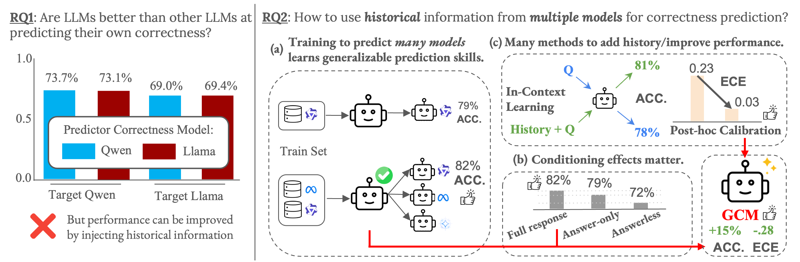

# General Correctness Models 
Official Repository for General Correctness Models: Learning calibrated and model-agnostic correctness predictors from historical patterns

Authors: [Hanqi Xiao](https://hanqixiao.github.io/), [Vaidehi Patil](https://vaidehi99.github.io/#home), [Hyunji Lee](https://amy-hyunji.github.io/), [Elias Stengel-Eskin](https://esteng.github.io/), [Mohit Bansal](https://www.cs.unc.edu/~mbansal/)


**Figure 1: RQ1 & RQ2 overview.** (Left) Self- vs. cross-model correctness prediction across Qwen and Llama shows that accuracies are comparable for each predictor model, suggesting no inherent advantage to a model predicting its own outputs. (Right) Historical information improves calibration: (a) training on multiple models’ histories learns generalizable strategies for correctness prediction; (b) predictive power comes from phrasing of output, the Correctness Model’s (CM) world knowledge, and matching performance to question type, with each stage generalizing and most prominently strategies for applying world knowledge; (c) history injected with post-hoc calibration and in-context learning helps improve correctness without finetuning. The Generalized Correctness Model (GCM) combines insights from RQs to achieve high accuracy and extremely low calibration error for the correctness prediction of multiple models, outperforming the logits of equally-sized and larger models.

## Abstract
Generating accurate and calibrated confidence estimates is critical for deploying LLMs in high-stakes or user-facing applications, and remains an open challenge. Prior research has often framed confidence as a problem of eliciting a model’s “self-knowledge”, i.e., the ability of an LLM to judge whether its own answers are correct; this approach implicitly assumes that there is some privileged information about the answer’s correctness that is accessible to the model itself. However, our experiments reveal that this assumption does not hold. Whether trained or training-free, an LLM attempting to predict the correctness of its own outputs generally performs no better than an unrelated LLM attempting the same task. In other words, LLMs have little self-knowledge for the purposes of correctness prediction. Moreover, we hypothesize that a key factor in predicting model correctness, i.e., building a “Correctness Model” (CM), is exposure to a target model’s historical predictions. We propose multiple methods to inject this historical correctness information, including training an LLM to predict the confidences of many other LLMs, i.e., creating a Generalized Correctness Model (GCM). We first show that GCMs can be trained on the correctness of historical predictions from many LLMs and learn patterns and strategies for correctness prediction applicable across datasets and models. We then use CMs as a lens for studying the source of correctness prediction ability and its generalization, systematically controlling their training data and finding that answer phrasing (i.e. how an LLM phrases and elaborates an answer) is a strong predictor for correctness. Moreover, our results suggest that a CM’s ability to leverage world knowledge about answers for correctness prediction is a key enabler for generalization. We further explore alternative methods of injecting history without training an LLM, finding that including history as in-context examples can help improve correctness prediction, and post-hoc calibration can provide complementary reductions in calibration error. We evaluate GCMs based on Qwen3-8B across 5 model families and the MMLU and TriviaQA datasets, as well as on a downstream selective prediction task, finding that reliable LLM confidence estimation is a generalizable and model-agnostic skill learned by systematically encoding correctness history rather than a model-specific skill reliant on self-introspection.

# Installation
## Packages
Please make sure that you have torch compiled with `CUDA` enabled. Repository developed with `python 3.12.2`, please ensure `python` envokes `python 3.12.2`.

Create virtual environment and Install packages from `requirements.txt`:
```bash
python -m venv ttfs_venv
source ttfs_venv/bin/activate
pip install -r requirements.txt
```

## Download Models and Datasets

### 🤗 Pre-trained GCM Models
Download our trained Generalized Correctness Models:

| Model | Dataset | Download Link |
|-------|---------|---------------|
| **Qwen3-8B GCM (MMLU)** | MMLU | [](https://huggingface.co/Hanqix/Qwen3-8B_GCM_MMLU_lora_model) |
| **Qwen3-8B GCM (TriviaQA)** | TriviaQA | [](https://huggingface.co/Hanqix/Qwen3-8B_GCM_TriviaQA_lora_model) |

### 📊 Training Datasets
Download the datasets used to train our GCMs:

#### MMLU Datasets
| Model | Download Link |
|-------|---------------|
| **Meta-Llama-3-70B-Instruct** | [](https://huggingface.co/datasets/Hanqix/GCM-dataset-Meta-Llama-3-70B-Instruct) |
| **gemma-3-27b-it** | [](https://huggingface.co/datasets/Hanqix/GCM-dataset-gemma-3-27b-it) |
| **Llama-3.1-8B-Instruct** | [](https://huggingface.co/datasets/Hanqix/GCM-dataset-Llama-3.1-8B-Instruct) |
| **Qwen2.5-3B-Instruct** | [](https://huggingface.co/datasets/Hanqix/GCM-dataset-Qwen2.5-3B-Instruct) |
| **Qwen2.5-7B-Instruct** | [](https://huggingface.co/datasets/Hanqix/GCM-dataset-Qwen2.5-7B-Instruct) |
| **Qwen2.5-32B-Instruct** | [](https://huggingface.co/datasets/Hanqix/GCM-dataset-Qwen2.5-32B-Instruct) |
| **Qwen2.5-72B-Instruct** | [](https://huggingface.co/datasets/Hanqix/GCM-dataset-Qwen2.5-72B-Instruct) |
| **Qwen3-8B** | [](https://huggingface.co/datasets/Hanqix/GCM-dataset-Qwen3-8B) |

#### TriviaQA Datasets
| Model | Download Link |
|-------|---------------|
| **gemma-3-27b-it** | [](https://huggingface.co/datasets/Hanqix/GCM-dataset-TriviaQA_gemma-3-27b-it) |
| **Llama-3.1-8B-Instruct** | [](https://huggingface.co/datasets/Hanqix/GCM-dataset-TriviaQA_Llama-3.1-8B-Instruct) |
| **Meta-Llama-3-70B-Instruct** | [](https://huggingface.co/datasets/Hanqix/GCM-dataset-TriviaQA_Meta-Llama-3-70B-Instruct) |
| **Qwen2.5-3B-Instruct** | [](https://huggingface.co/datasets/Hanqix/GCM-dataset-TriviaQA_Qwen2.5-3B-Instruct) |
| **Qwen2.5-7B-Instruct** | [](https://huggingface.co/datasets/Hanqix/GCM-dataset-TriviaQA_Qwen2.5-7B-Instruct) |
| **Qwen2.5-32B-Instruct** | [](https://huggingface.co/datasets/Hanqix/GCM-dataset-TriviaQA_Qwen2.5-32B-Instruct) |
| **Qwen2.5-72B-Instruct** | [](https://huggingface.co/datasets/Hanqix/GCM-dataset-TriviaQA_Qwen2.5-72B-Instruct) |
| **Qwen3-8B** | [](https://huggingface.co/datasets/Hanqix/GCM-dataset-TriviaQA_Qwen3-8B) |

### 📥 Usage
After downloading, place the datasets in your `results_dir` and models in your preferred directory. Update the paths in your evaluation scripts accordingly.

## Run Evaluations

Evaluation scripts for trained correctness models on various datasets and compute calibration metrics on MMLU and TriviaQA:
```bash
source scripts/evaluate_trained_models/MMLU_Table/multidataset_evaluate_on_id_k0_gen_on_all_datasets.sh
source scripts/evaluate_trained_models/TriviaQA_Table/multidataset_evaluate_on_id_k0_gen_on_all_datasets.sh
```
Evaluation script for OOD evaluations on MMLU
```bash
source scripts/evaluate_trained_models/MMLU_Table/multidataset_evaluate_on_ood_k0.sh
```
Evaluation script for cross-dataset generalization (RQ1):
```bash
source scripts/cross_testing_experiments/z_crosstesting_answerful.sh
source scripts/cross_testing_experiments/z_crosstesting_answerless.sh
```
To capture results please make use of piping `>` or another utility of your choosing to capture stout. Results are available via a block starting with `average_accuracy`, one result should be found per evaluation dataset.

### Specify Paths and Configurations
Ensure that the following variables are defined according to your system.
Datasets should be create in `results_dir`. Set `device` as arguments to `CUDA_VISIBLE_DEVICES` for training, and `eval_device` for evaluation. Make sure to set `model_to_evals` to the directory containing the model you wish to evaluate.

```bash
results_dir="ttfs_project/results"
device="0,1,2,3"
eval_device="0,1,2,3"
model_to_evals=(model_to_evaluate)
```

## Train Models
Reference Training scripts for Generalized Correctness Models are available in `scripts/train_generalized_correctness_model/`, please use `tuning_models/merge_datasets.py` to merge the datasets you want to use to train a GCM.

## Other Evaluation Tools
The `tuning_models/` directory contains utilities for:
- `posthoc_calibration.py`: Apply calibration methods to model predictions, access script through `scripts/evaluate_trained_models/postcalibrate_gen.sh`.

Example usage:
```bash
python tuning_models/evaluate_training_dataset_performance.py \
    --file1 results/model_outputs.jsonl \
    --tokenizer "Qwen/Qwen2.5-7B-Instruct" \
    --do_accuracy_eval
```

Evaluation results are automatically saved in the specified `results_dir` for further analysis and comparison.
